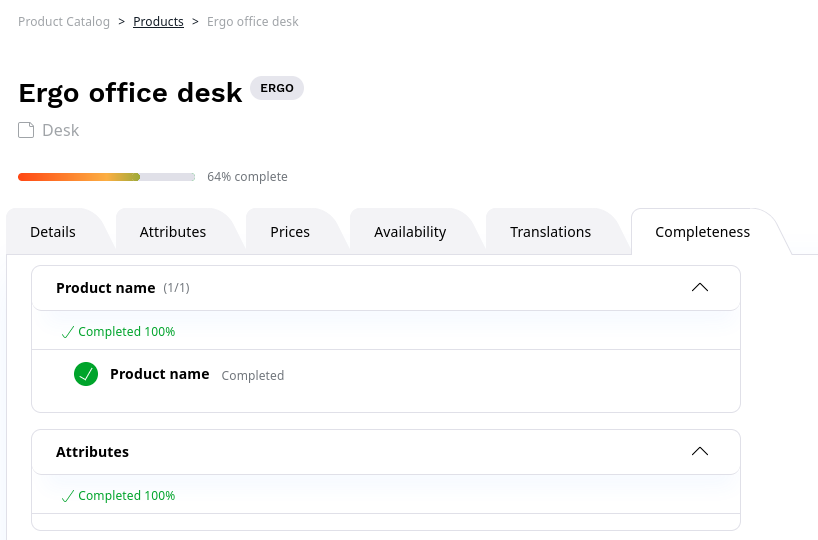

# Add product completeness task

Product completeness helps you track how much of a product in the catalog you already have configured,
and how much work is still left.

By default, the **Completeness** tab in product view lists tasks such as configuring attributes,
adding prices or setting availability.

You can also add other information to the completeness tab to track other aspects of product configuration.

The following example shows how to add a "Name" entry that indicates if the product name is configured.

## Create task

First, create a task class that contains task configuration and defines which aspect of the product to track.

The task class must extend `Ibexa\Bundle\ProductCatalog\UI\Completeness\Task\AbstractTask`.

``` php
[[= include_file('code_samples/catalog/custom_completeness_task/src/Completeness/Task/NameTask.php') =]]
```

`getEntry()` returns the result of the task. In this case, `BooleanEntry` means the task can either be fully completed (the product has a name), or not started.

Then, register the task as a service and tag it with `ibexa.product_catalog.completeness.task`

``` yaml
[[= include_file('code_samples/catalog/custom_completeness_task/config/custom_services.yaml') =]]
```

## Add templates

Next, add the template that renders the task progress in the **Completeness** tab.

In your content view configuration, add a template for a task under `product_catalog.completeness.tasks`:

``` yaml
[[= include_file('code_samples/catalog/custom_completeness_task/config/packages/completeness.yaml') =]]
```

Then, add the indicated template to `templates/themes/admin/product_catalog/product/tab/completeness`:

``` html+twig
[[= include_file('code_samples/catalog/custom_completeness_task/templates/themes/admin/product_catalog/product/tab/completeness/name_completeness_task.html.twig') =]]
```

This template is based on the built-in templates contained in `vendor/ibexa/product-catalog/src/bundle/Resources/views/themes/admin/product_catalog/product/tab/completeness`.

## Preview results

Finally, you can create a product, publish it and view its **Completeness** tab with the new information:


